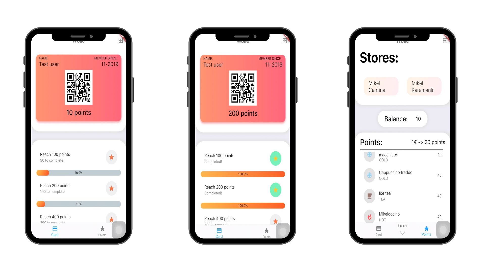

# wolie_mobile

The main goal of the current thesis is to demonstrate the development and evolution of an idea can have while transforming into a real product when we follow the Lean Startup methodology (Build - Measure - Learn). To be more specific, we will focus on the QSR industry and examine the value of centralised loyalty programs.

In order to implement this idea, we have developed a mobile application which allows the end user to subscribe to multiple different venues, scan the personalised QR code of each store, collect points or stamps and earn gifts once he/she reaches the required threshold. There is also the option for users to trade points between themselves if they are both subscribed to the same store. Last but not least, the store has the option to accept and refuse the user requests and also define which loyalty program they want to run and the specifications they wish to have.

#### App Screenshots

